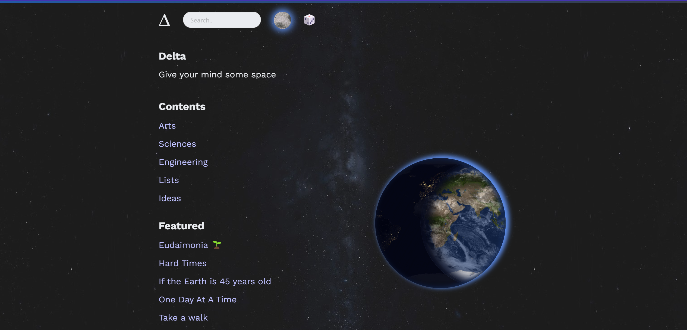

# Δ Delta  

View at <https://selimslab.github.io>



## Setup

1. clone the repo
2. install ruby <https://www.ruby-lang.org/en/downloads/>
3. `gem install bundler jekyll`
4. `bundle install`

## Serve
```
bundle exec jekyll serve --trace --incremental --profile
```

## Deploy 

Git push to main triggers a github action 

[](https://github.com/selimslab/selimslab.github.io/actions/workflows/pages.yml)


## Origin of the name 


The name comes from the greek letter **delta**(Δ), 
it's used as mathematical symbol of change,   
often for incremental change. 

It reflects the philosophy of doing one little thing at a time. 
- Writing clarifies mind.   
- Editing provides natural spaced repetition.  
- Ideas spark each other and connect in creative ways. 

This is a place to bring together everything I like online.  

Links, essays, photos, artworks, drawings, poetry, lists, code snippets, experiments, ..


## How it works 

- Uses plain markdown files
- Each page has a unique name
- Pages can link to each other using:
  - HTML links
  - Markdown links 
  - [[wikilink]] format
- Pages show their incoming links
- Files can tag each other by name
- Tags appear above page titles
- _plugins\gen.rb pre-processes pages to:
  - Build document tree
  - Convert wikilinks to HTML
  - Add backlinks metadata
  - Generate [3D Graph visualization](https://selimslab.github.io/graph-3d)
- Published with Jekyll using [barryclark/jekyll-now](https://github.com/barryclark/jekyll-now)
- Works offline via service worker
  - Caches all pages (4-5mb) on first visit

