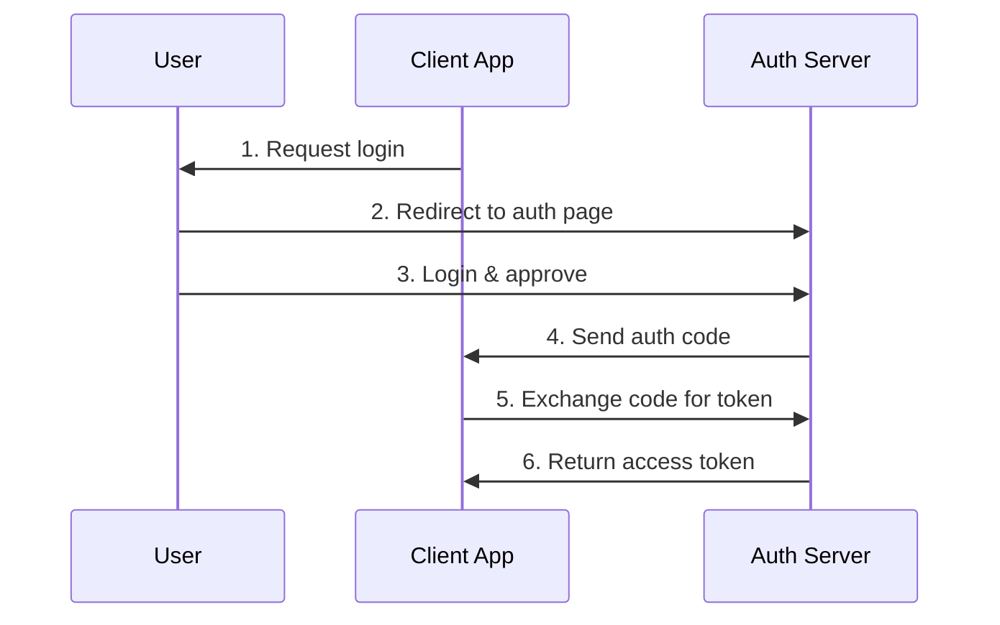

```python
from abc import ABC, abstractmethod
from dataclasses import dataclass
from typing import Optional

@dataclass
class Client:
    client_id: str
    client_secret: str
    redirect_uri: str

@dataclass 
class User:
    user_id: str
    username: str

class AuthServer(ABC):
    @abstractmethod
    def handle_login(self, username: str, password: str) -> Optional[User]:
        """Step 3: User logs in"""
        pass
    
    @abstractmethod
    def generate_auth_code(self, client_id: str, user_id: str) -> Optional[str]:
        """Step 4: Generate authorization code"""
        pass

    @abstractmethod
    def exchange_code_for_token(self, client_id: str, client_secret: str, auth_code: str) -> Optional[str]:
        """Step 5-6: Exchange auth code for access token"""
        pass

class ClientApp(ABC):
    @abstractmethod
    def request_login(self) -> str:
        """Step 1: Initiate login flow"""
        pass

    @abstractmethod
    def handle_auth_code(self, auth_code: str) -> Optional[str]:
        """Step 4-5: Handle auth code and exchange for token"""
        pass

    @abstractmethod
    def use_access_token(self, access_token: str):
        """Use the access token to access protected resources"""
        pass

```
